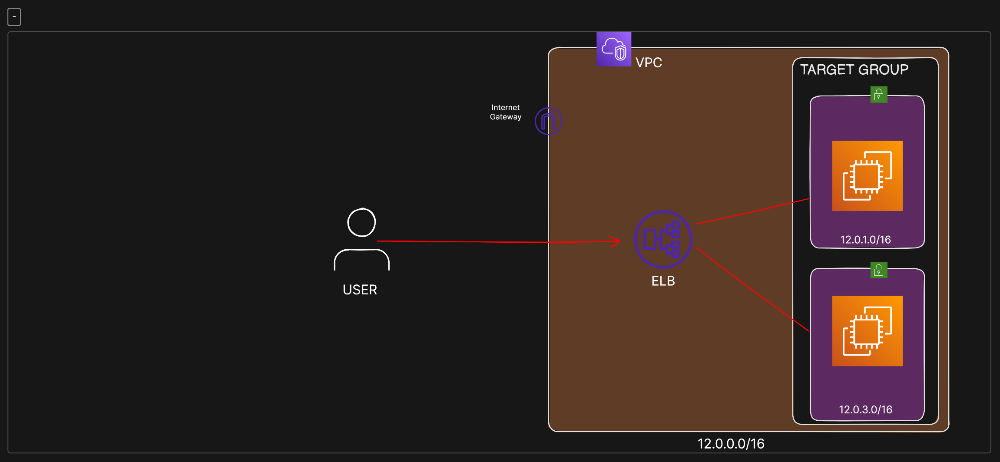

# AWS Load Balancer Project

## Overview

This project demonstrates the implementation of a load balancer in AWS using a Virtual Private Cloud (VPC), two public subnets, EC2 instances, and an Application Load Balancer (ALB). The ALB distributes incoming traffic across multiple EC2 instances to ensure scalability and availability.

## Project Structure

The following components were created in this project:

### 1. Virtual Private Cloud (VPC)

- **Name:** Test-alb-VPC
- **IPv4 CIDR Block:** 12.0.0.0/16

### 2. Public Subnets

- **Subnet 1:** 
  - **CIDR Block:** 12.0.1.0/24
  - **Availability Zone:** Mumbai South AP 1a
- **Subnet 2:** 
  - **CIDR Block:** 12.0.3.0/24
  - **Availability Zone:** Mumbai South AP 1b

### 3. Internet Gateway

- Enables internet access for resources in the public subnets.

### 4. Route Table

- Associated with both public subnets.
- Routes traffic to the Internet Gateway for public access.

### 5. EC2 Instances

- Launched in both public subnets.
- Configured with auto-assign public IPs, security groups allowing HTTP (port 80) and SSH (port 22) access.
- Add userdata bash Script

### 6. Application Load Balancer (ALB)

- Routes incoming traffic to EC2 instances.
- Linked to the VPC, public subnets, and a created security group.
- Handles traffic on HTTP port 80.

### 7. Target Group

- Includes both public subnets in the VPC.
- Configured with HTTP port 80.

## Conclusion
- When the request is sent to ALB via the DNS link it directs the response to EC2 Instance 1
 
- And when we agein send request, the response is  

 
<strong>By exploring this project, you can witness the implementation of load balancing in AWS, ensuring scalability and high availability for web applications.</strong>
